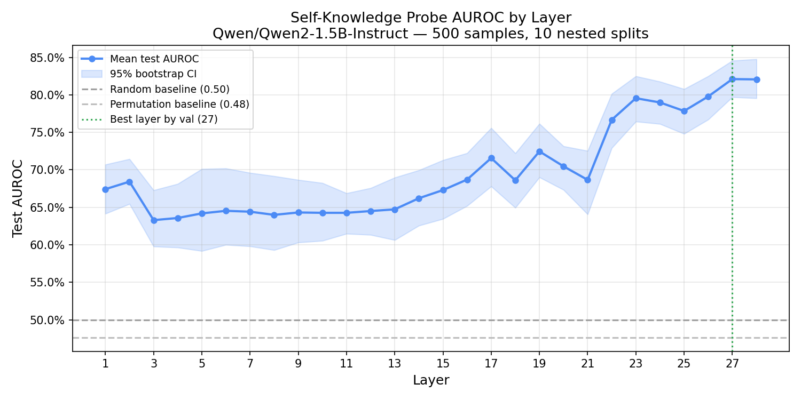

# Linear Probing for Correctness Signals in LLM Hidden States

**Author:** Aayush Singh  
**GitHub:** [aayush1234434-stack/llm-hidden-state-analysis](https://github.com/aayush1234434-stack/llm-hidden-state-analysis)

> **Attribution:** The research question, framing, and Gnosis method originate from [Ghasemabadi & Niu (2025)](https://arxiv.org/abs/2512.20578), [*Can LLMs Predict Their Own Failures? Self-Awareness via Internal Circuits*](https://arxiv.org/abs/2512.20578) ([official code](https://github.com/Amirhosein-gh98/Gnosis)).
>
> This repository is an **independent linear-probing study** on **Qwen2-1.5B-Instruct + TriviaQA** with a fully reproducible evaluation pipeline. It is **not** the original Gnosis paper or implementation.

---

## Quick Start

```bash
pip install -r requirements.txt
pip install torch  # platform-specific wheel from https://pytorch.org

python src/demo.py --no-show-plot
```

---

## Motivation

When a transformer generates text, it produces a hidden-state vector at every layer. If a model internally "knows" it might be wrong, that signal may already be present in those activations before generation is complete.

Following **Ghasemabadi & Niu (2025)**, this project asks:

> Can answer correctness be linearly decoded from hidden states during generation?

Using logistic regression probes trained on hidden states from **Qwen2-1.5B-Instruct**, we test whether each transformer layer encodes whether the model's answer will ultimately be correct on **TriviaQA**.

---

## Results

### Main Metrics (500 TriviaQA Validation Samples)

| Metric | Value |
|----------|----------|
| Model EM Accuracy | **12.2%** (61 / 500) |
| Probe AUROC (Layer 27) | **0.809** [0.780, 0.841] |
| Probe Balanced Accuracy | **0.584** [0.541, 0.627] |
| Permutation Baseline AUROC | **0.476** [0.451, 0.502] |
| Best Layer | **27** |



### Takeaway

A simple linear probe achieves **AUROC ≈ 0.81** at late layers, substantially outperforming a permutation baseline near chance level.

This suggests correctness information is already encoded in internal activations before answer generation is complete.

> **Important:** Because 87.8% of examples are labeled incorrect, raw accuracy is misleading. A classifier that always predicts "wrong" already achieves 87.8% accuracy. AUROC and balanced accuracy are therefore the primary metrics.

---

## Key Findings

### 1. Correctness Is Linearly Decodable

The strongest probe reaches:

```text
AUROC = 0.809
95% CI = [0.780, 0.841]
```

compared with:

```text
Permutation baseline AUROC = 0.476
```

Layer selection is performed strictly using validation data within nested train/validation/test splits.

### 2. Signal Concentrates in Late Layers

The strongest performance appears around layers **22–28**, with AUROC values approximately **0.77–0.82**.

Earlier layers remain substantially weaker, around **0.64–0.65 AUROC**, suggesting correctness-related information becomes increasingly explicit near the top of the network.

### 3. Mid-Layer Bump

A secondary increase appears around layers **15–19**, with AUROC values approximately **0.67–0.72**.

This may reflect an intermediate stage of internal reasoning before final answer formation.

### 4. Strict Labeling Depresses Apparent Model Accuracy

Under TriviaQA exact-match evaluation with answer extraction, the model achieves only **12.2% EM**.

Inspection of `results/label_audit.json` reveals many failures arise from:

- verbose outputs
- extraction mistakes
- formatting mismatches

rather than necessarily lacking the correct answer internally.

---

## Experimental Setup

| Setting | Value |
|----------|----------|
| Model | Qwen/Qwen2-1.5B-Instruct |
| Dataset | TriviaQA (rc.nocontext validation split) |
| Samples | 500 |
| Hidden States | First generated token from all 28 layers |
| Probe | Logistic Regression (C=1.0, max_iter=1000) |
| Evaluation | Nested train/val/test splits |
| Baselines | Majority class, label permutation |
| Label | TriviaQA official normalization + alias-matched EM |

---

## Method

For each TriviaQA question:

1. Prompt the model.
2. Generate an answer using greedy decoding.
3. Capture hidden states from the first generated token.
4. Label the answer using TriviaQA exact-match scoring.
5. Train layer-wise logistic regression probes.
6. Evaluate using nested validation and held-out test splits.

```text
Question
   ↓
Qwen2-1.5B-Instruct
   ↓
Generated Answer
   ↓
Hidden States (28 layers)
   ↓
Correct / Incorrect Label
   ↓
Logistic Regression Probe
   ↓
AUROC Evaluation
```

---

## Limitations

### Severe Class Imbalance

Approximately:

```text
87.8% incorrect
12.2% correct
```

Therefore raw accuracy is misleading.

### Answer Extraction Issues

The model often ignores the "few words" instruction and generates verbose outputs.

Strict answer extraction can underestimate true correctness.

### Single Model / Dataset

Results currently cover:

- Qwen2-1.5B-Instruct
- TriviaQA

only.

### Linear Probes Only

The original Gnosis work trains a dedicated head using hidden states and attention patterns.

This repository intentionally focuses on simple linear probes as a baseline analysis.

### Correlation ≠ Causation

High probe AUROC demonstrates that correctness information is encoded in activations.

It does **not** prove the model uses that information during generation.

---

## Repository Scope

| Track | Purpose | Entry Point |
|---------|---------|---------|
| Hidden-State Probing (Primary) | Linear probing replication on Qwen2 + TriviaQA | `python src/demo.py` |
| Gnosis SFT Pipeline (WIP) | Follow-up work aligned with the official Gnosis implementation | `gnosis/DATA_PREPROCESS.md` |

The probing experiment is completely self-contained and requires only:

```bash
pip install -r requirements.txt
python src/demo.py
```

---

## Repository Structure

```text
src/
├── demo.py
├── collect_activations.py
├── train_probes.py
├── plot_results.py
├── probe/
└── triviaqa_eval.py

configs/
└── probe_default.yaml

gnosis/
├── DATA_PREPROCESS.md
├── open-r1/
└── src/

results/
assets/
```

---

## Running the Experiment

See `REPRODUCIBILITY.md` for exact package versions, model revisions, seeds, and hardware notes.

Run the full pipeline:

```bash
python src/demo.py --no-show-plot
```

Collect activations only:

```bash
python src/demo.py --stage collect
```

Train probes only:

```bash
python src/demo.py --stage train --no-show-plot
```

Generate plots only:

```bash
python src/demo.py --stage plot --no-show-plot
```

---

## Outputs

| File | Description |
|--------|--------|
| `results/run_manifest.json` | Versions, hardware, seeds, revisions |
| `results/results.json` | Per-sample generations and labels |
| `results/activations.npz` | Hidden states |
| `results/label_audit.json` | Manual label-quality audit |
| `results/validation_results.json` | Nested-CV metrics and confidence intervals |
| `assets/layer_probe_accuracy.png` | Layer-wise AUROC figure |

---

## Figures

| File | Source |
|------|--------|
| `assets/layer_probe_accuracy.png` | **This repo** — layer-wise probe AUROC from the 500-sample run |
| `assets/main_fig.png` | From [Ghasemabadi & Niu (2025)](https://arxiv.org/abs/2512.20578) / [Gnosis repo](https://github.com/Amirhosein-gh98/Gnosis) (reference only) |
| `assets/Gnosis_demo.gif` | From [Gnosis repo](https://github.com/Amirhosein-gh98/Gnosis) (reference only) |

## Citation

```bibtex
@article{ghasemabadi2025can,
  title={Can LLMs Predict Their Own Failures? Self-Awareness via Internal Circuits},
  author={Ghasemabadi, Amirhosein and Niu, Di},
  journal={arXiv preprint arXiv:2512.20578},
  year={2025}
}
```

---

## Future Work

- Improve answer extraction and prompting
- Compare probe AUROC against token log-probability baselines
- Evaluate larger models
- Test additional benchmarks
- Implement the full Gnosis head (hidden states + attention)
- Study whether self-awareness signals can improve generation quality
